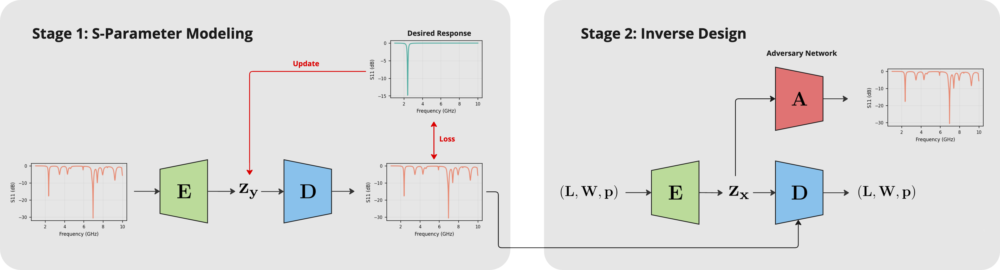

# Improving Generative Inverse Design of Rectangular Patch Antennas with Test Time Optimization

[](https://opensource.org/licenses/MIT) [](https://www.python.org/downloads/release/python-380/) [](https://arxiv.org/abs/2505.18188) [](https://huggingface.co/datasets/becklabash/rectangular-patch-antenna-freq-response)


## Overview
This repository implements the framework and experiments described in our paper **"Improving Generative Inverse Design of Rectangular Patch Antennas with Test Time Optimization."**. We propose a two-stage inverse design framework for generating rectangular patch antennas that meet target frequency response specifications. Further, we show that leveraging search and optimization techniques at test-time improves the accuracy of the generated designs and enables consideration of auxiliary
objectives such as manufacturability.

<div align="center">
<p align="center">
  
</p>
</div>


## Setup

### Install from Source

1. **Clone the repository and navigate into its directory:**
    
    ```bash
    git clone https://github.com/becklabs/patch-antenna-tto.git
    cd patch-antenna-tto
    ```
    
2. **Install the `patchtto` package in editable mode:**
    
    ```bash
    pip install -e .

    ```

### Download Dataset

Our custom simulation dataset used for training and evaluation is available via [🤗 Datasets](https://huggingface.co/datasets/becklabash/rectangular-patch-antenna-freq-response).

Run the following command from the root of the repository to download and preprocess the dataset:
```bash
python -m scripts.huggingface.download_dataset
```

This command will save the preprocessed dataset to `data/results/preprocessed_all/`, where the training and evaluation configurations expect to find it.

### Install openEMS (optional)
To run the simulation harness, you will need to install `openEMS`. Detailed instructions can be found [here](https://openems.com/docs/install/). `openEMS` was successfully installed on macOS Sonoma 14.5 (M2 Chip) via the following method:

1. Update Homebrew
```bash
brew update
brew upgrade
brew cleanup
```

2. Tap the openEMS repository
```bash
brew tap thliebig/openems https://github.com/thliebig/openEMS-Project.git
```

3. Install openEMS
```bash
brew install --HEAD openems
```

4. Build the CSXCAD Python bindings
```bash
cd ~/Library/Caches/Homebrew/openems--git/CSXCAD/python
python setup.py build_ext -I /opt/homebrew/opt/openems/include -L /opt/homebrew/opt/openems/lib -R /opt/homebrew/opt/openems/lib
```

5. Build the openEMS Python bindings
```bash
cd ~/Library/Caches/Homebrew/openems--git/openEMS/python
python setup.py build_ext -I /opt/homebrew/opt/openems/include -L /opt/homebrew/opt/openems/lib -R /opt/homebrew/opt/openems/lib
```


### Login to Weights & Biases (optional)
For tracking training experiments, you will need a [Weights & Biases](https://wandb.ai/site) account.

**Login into Weights and Biases:**

```bash
wandb login
```

## Training

The repository contains several training scripts for different components of the framework:

### S11 VAE Training

Train the S11 VAE to learn representations of antenna frequency responses:

```bash
python scripts/s11_vae/train.py --config config/train/s11_vae.yaml
```

### Design CVAE Training

Train the Conditional VAE (CVAE) model to learn a distribution of designs conditioned on a target S11 curve:

```bash
python scripts/design_cvae/train.py --config config/train/design_cvae.yaml
```

### Surrogate Model Training

Train the forward surrogate model for approximating the EM simulation:

```bash
python scripts/forward_model/train_betanll.py --config config/train/surrogate_nll.yaml
```

Each configuration file under the `config/` directory specifies training hyperparameters, dataset paths, and checkpointing details. 

---

## Experiments

Reproduce experiments from the paper using the provided scripts:

### Inverse Design Experiment

Run the full inverse design framework to generate antenna designs that meet target S11 specifications:

```bash
python scripts/experiments/inverse_design.py
```

This script combines generative modeling, latent space optimization, and simulation-based scoring to produce candidate designs.

### Scaling Experiments

Study the effect of varying the number of latent curves or design samples:

- **Number of Curves Scaling:**
    
    ```bash
    python scripts/experiments/n_curves_scaling.py
    ```
    
- **Number of Designs Sampling:**
    
    ```bash
    python scripts/experiments/n_designs_scaling.py
    ```
    
## ️ Citation
If you find our work helpful, please use the following citation.

```
@misc{labash2025improvinggenerativeinversedesign,
      title={Improving Generative Inverse Design of Rectangular Patch Antennas with Test Time Optimization}, 
      author={Beck LaBash and Shahriar Khushrushahi and Fabian Ruehle},
      year={2025},
      eprint={2505.18188},
      archivePrefix={arXiv},
      primaryClass={eess.SP},
      url={https://arxiv.org/abs/2505.18188}, 
}
```

## License

MIT. Check [LICENSE](https://chatgpt.com/c/LICENSE) for details.

## Contact

For questions or feedback, please open an issue or contact [labash.b@northeastern.edu](mailto:labash.b@northeastern.edu).

