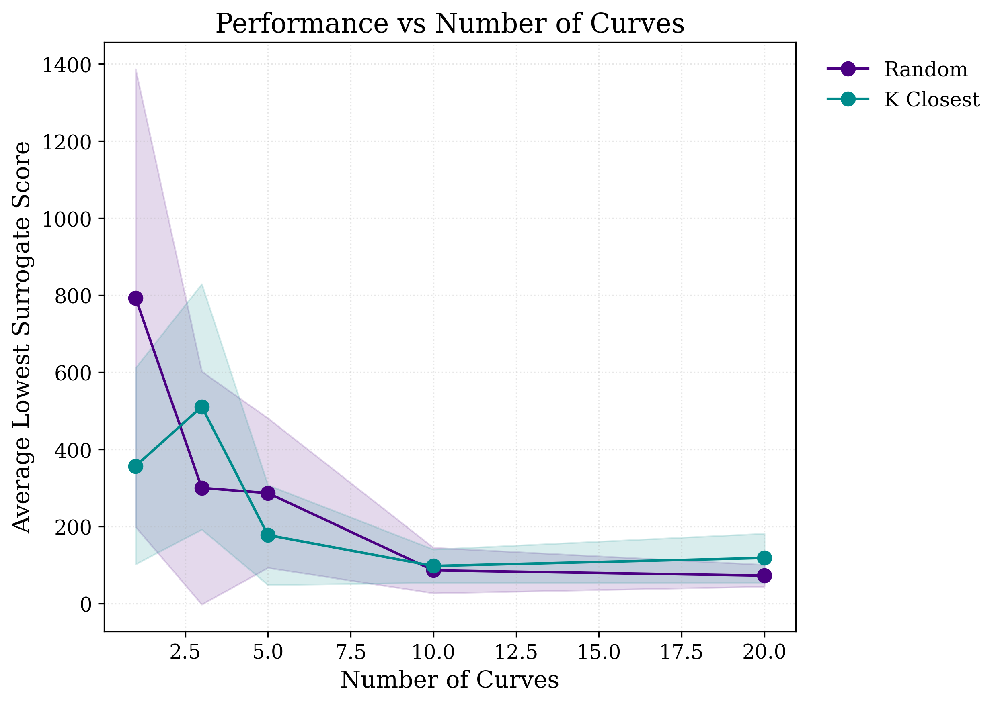
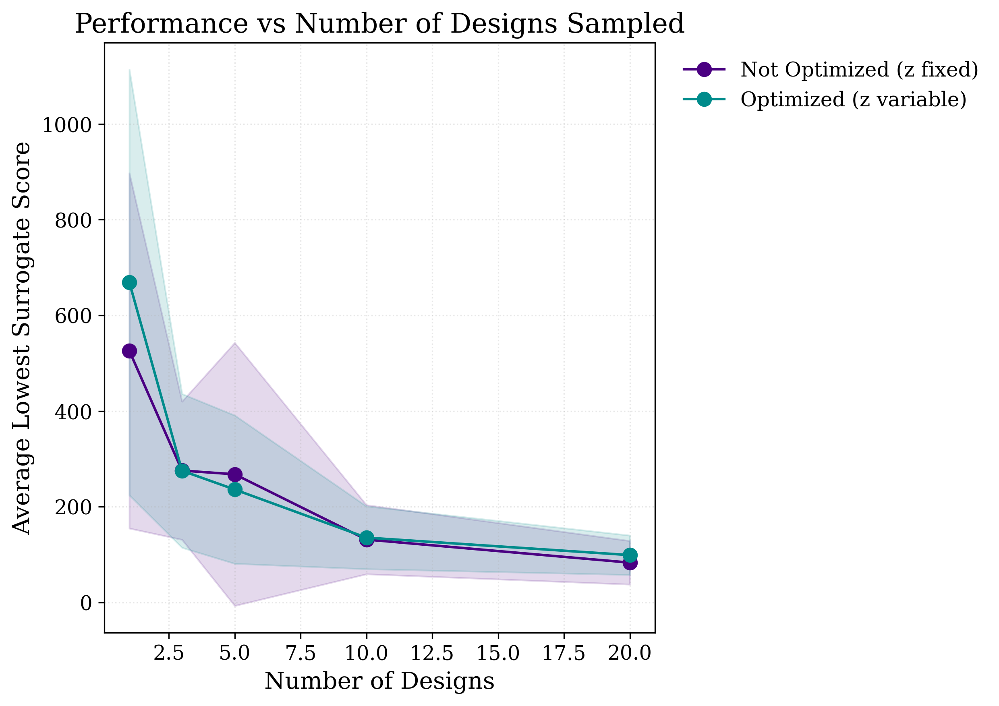
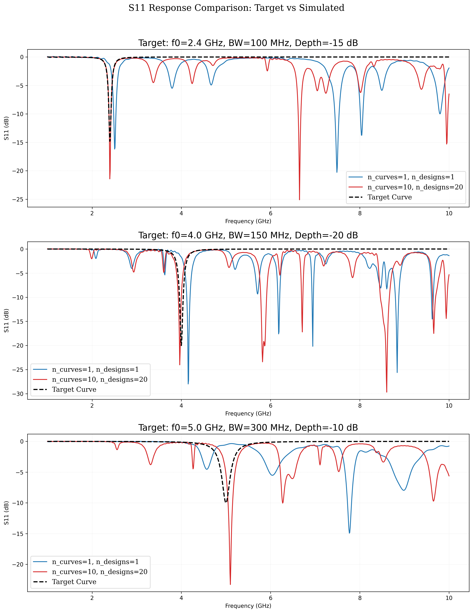

# Improving Generative Inverse Design of Rectangular Patch Antennas with Test Time Optimization

## Abstract
We propose a two-stage deep learning framework for the inverse design of rectangular patch antennas. Our approach leverages generative modeling to learn a latent representation of antenna scattering parameters and conditions a subsequent generative model on these parameters to produce feasible antenna geometries. 
We further demonstrate that leveraging search and optimization techniques at test-time improves the accuracy of the generated designs and enables consideration of auxilliary objectives such as manufacturability. Our approach generalizes naturally to different design criteria, and can be easily adapted to more complex geometric design spaces. 

## Experiments

#### Test Time Compute Scaling

    
    

#### Target vs Simulated Responses

